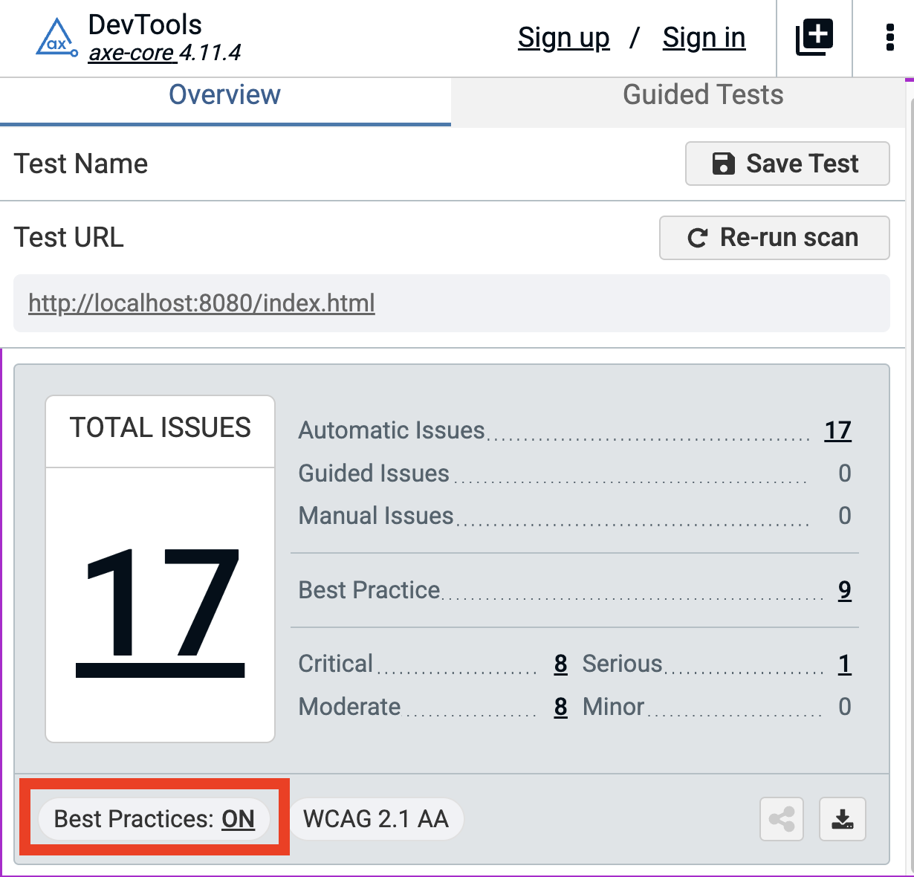

# Prerequisites — Set up before the workshop

> [!IMPORTANT]
> Please complete **all** the steps below *before* you arrive. The conference Wi-Fi is slow and installing Node, the UI5 app, and Claude Code on-site will eat into your hands-on time.

---

## Required setup (everyone)

You'll need:

| Tool | Version | Why |
| --- | --- | --- |
| **Node.js** | `^20.17.0` or `>=22.9.0` | Runs the UI5 dev server |
| **npm** | `>=8` | Installs the UI5 app |
| **Git** | any recent | Clones the workshop repo |
| A modern browser | Chrome / Edge / Firefox | Runs the UI5 app |
| A text editor / IDE | VS Code, WebStorm, … | Edits XML / TypeScript files in Exercises 1–5 |
| **axe DevTools** browser extension | latest | Scans the app for a11y violations — used to verify each fix |
| **HeadingsMap** browser extension | latest | Visualises the page's heading outline — used in the headings exercise |
| **Claude Code CLI** or **claude.ai web chat** | latest | Runs the `ui5-accessibility` skill in Exercise 6 |

### Step 1 — Install Node.js and npm

Node.js ships with npm bundled. Install the **LTS** build for your OS:

| OS | Recommended way |
| --- | --- |
| **macOS / Windows / Linux** | Download the LTS installer from <https://nodejs.org/en/download> and run it |
| **macOS (Homebrew)** | `brew install node@22` |

**Verify** — both commands must print a version:

```bash
node -v   # → v22.x.x (or v20.17.x+)
npm  -v   # → 10.x.x (or 8.x.x+)
```

> If your terminal says `command not found` after install, **close and reopen** the terminal so the new `PATH` is picked up.

📖 Docs: <https://nodejs.org/en/learn/getting-started/how-to-install-nodejs>

### Step 2 — Install Git

| OS | Command |
| --- | --- |
| **macOS** | `xcode-select --install` *(or)* `brew install git` |
| **Windows** | Download from <https://git-scm.com/download/win> |
| **Linux** | `sudo apt install git` *(Debian/Ubuntu)* / `sudo dnf install git` *(Fedora)* |

**Verify:**

```bash
git --version   # → git version 2.x.x
```

### Step 3 — Install the axe DevTools browser extension

We use the free **axe DevTools** extension to scan the app for accessibility violations before and after each fix — it's the quickest way to see what the screen reader sees.

Install it for Chrome (Edge users — same link, Edge accepts Chrome extensions):

🔗 <https://chromewebstore.google.com/detail/axe-devtools-web-accessib/lhdoppojpmngadmnindnejefpokejbdd>

Firefox users: <https://addons.mozilla.org/en-US/firefox/addon/axe-devtools/>

**Verify:** open DevTools (F12) on any page, and look for an **axe DevTools** tab next to Elements / Console / Network. If you see it, you're set — no login or paid features needed for this workshop.

> The free tier of axe DevTools is enough for everything we do here. You can ignore the "Sign in for more features" prompts.

> [!IMPORTANT]
> After you scan the app with axe DevTools, make sure the **"Best practices"** toggle is set to **on**. Several of the issues we fix in the exercises are reported only when this toggle is enabled — with it off, axe will miss them and the scan results won't match what's described in the lectures.
>
> 

### Step 4 — Install the HeadingsMap browser extension

**HeadingsMap** renders a page's `<h1>`–`<h6>` outline in a side panel. In the headings exercise we use it to *see* the outline flatten (or jump levels) at a glance — much faster than inspecting one `<h*>` element at a time in DevTools.

Install it for Chrome (Edge users — same link, Edge accepts Chrome extensions):

🔗 <https://chromewebstore.google.com/detail/headingsmap/flbjommegcjonpdmenkdiocclhjacmbi>

Firefox users: <https://addons.mozilla.org/en-US/firefox/addon/headingsmap/>

**Verify:** open any content-rich page (e.g. <https://en.wikipedia.org>), click the HeadingsMap icon in your extensions toolbar, and confirm the side panel opens with a numbered `H1` / `H2` / … tree.

### Step 5 — Clone the workshop repository

> [!TIP]
> **Clone (or unzip) the repo onto your Desktop.** It keeps the path short and predictable so the `cd` commands in Exercise 1 work as written — and you can find the folder again without hunting through Finder / File Explorer.

First, move into your Desktop folder:

| OS | Command |
| --- | --- |
| **macOS / Linux** | `cd ~/Desktop` |
| **Windows (PowerShell / cmd)** | `cd %USERPROFILE%\Desktop` |

Then clone the repo (still inside your Desktop folder):

```bash
# HTTPS (works everywhere)
git clone https://github.com/SAP-samples/ui5con-2026-a11y-hands-on.git

# or SSH (if you have an SSH key set up on GitHub)
git clone git@github.com:SAP-samples/ui5con-2026-a11y-hands-on.git

cd ui5con-2026-a11y-hands-on
```

You should now have a folder called **`ui5con-2026-a11y-hands-on`** sitting on your Desktop.

> No git? Download the ZIP from the GitHub UI — green **Code** button → **Download ZIP**, move the file to your **Desktop**, and unpack it there. Rename the unpacked folder to `ui5con-2026-a11y-hands-on` (it sometimes unpacks as `ui5con-2026-a11y-hands-on-main`) so the paths in Exercise 1 line up.

### Step 6 — Set up Claude (for Exercise 6)

Exercise 6 shows how a Claude Code *skill* can apply an a11y fix across the codebase on its own. You will run the skill yourself — pick **one** of the two options below.

You can use Claude in one of two ways:

| | **Option A — Claude Code (CLI)** ⭐ recommended | **Option B — claude.ai web chat** |
| --- | --- | --- |
| **What it is** | Claude runs in your terminal and edits files directly | Claude runs in the browser; you copy/paste code in and out |
| **Plan needed** | Claude **Pro / Max** *or* Anthropic Console (paid) | Claude **Free / Pro / Max** — Free works! |
| **Install effort** | npm install of the Claude Code CLI | None — just a browser |
| **Skills support** | Full skill support via `.claude/skills/` | Use [Projects + custom instructions](https://support.claude.com/en/articles/10185728-understanding-claude-s-projects) as a substitute |

#### Option A — Claude Code CLI

If you already have the Claude Code CLI installed *and* an active Claude subscription (Pro / Max, or an Anthropic Console / API account), you're all set for Exercise 6 — **skip to the verify step below**.

If not, install it: <https://docs.claude.com/en/docs/claude-code/quickstart>. Sign in when the CLI prompts.

**Verify:**

```bash
claude --version
```

Then open the workshop repo in Claude Code (`cd ui5con-2026-a11y-hands-on && claude`) and type `/help` — you should see the built-in slash commands listed.

#### Option B — claude.ai web chat

Use this if you don't have a Claude paid plan or don't want to install the CLI.

1. **Create or sign in** at <https://claude.ai>. The Free plan covers Exercise 6.
2. **Create a Project** (sidebar → **+ New Project**) and name it `ui5con-2026-a11y`.
3. In **Project knowledge**, upload `webapp/view/Main.view.xml` and `webapp/manifest.json` from the cloned repo.
4. **Smoke test** — open a chat in the Project and paste:

   ```
   Based on the files in this Project, what does this app do? Give me a one-paragraph summary.
   ```

   A reasonable summary means you're ready.

In Exercise 6 we'll explain how to substitute a Claude Code skill with a claude.ai custom instruction. The full free-tier walkthrough — including the exact prompt to paste — lives in [**06-claude-web-prompt.md**](06-claude-web-prompt.md).

---

✅ Once Steps 1–6 are done, you're ready for the workshop.

---

[Back to README](../README.md) · [Next: Start the app →](start-the-app.md)
